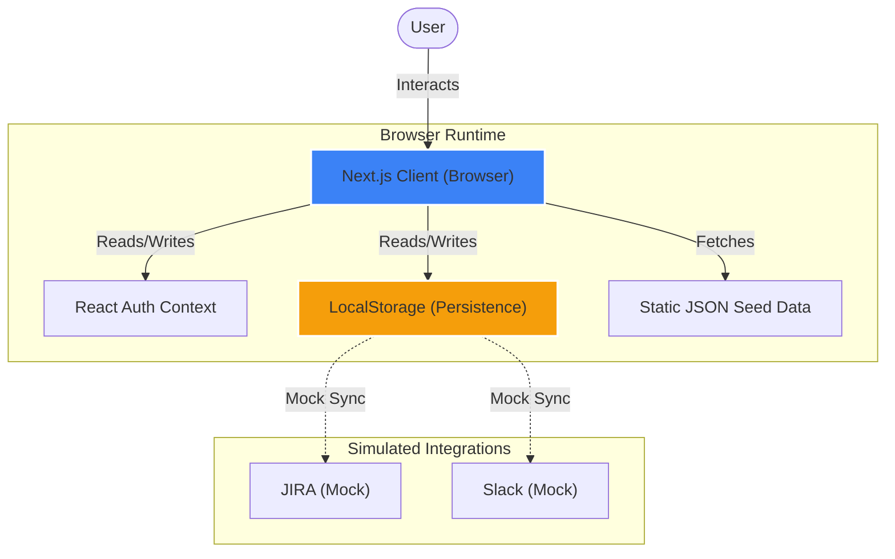

# Helix | Follow-the-Sun Orchestrator

**Helix** is an AI-powered global delivery intelligence platform designed to eliminate the friction of handovers between distributed consulting teams. This proof-of-concept application demonstrates how Agentic AI can preserve context, structure work, and predict transition complexity across timezones.


## 🚀 Key Features

*   **Global Command Center**: A unified dashboard visualizing real-time operations across 5 global hubs (Sydney, Singapore, Bangalore, London, New York).
*   **AI-Powered Handovers**: Intelligent summarization of work items, critical decisions, and risk flags.
*   **Predictive Analytics**: AI-driven complexity scoring and transition time estimation.
*   **Interactive Demo Mode**: A guided "David Chen" persona experience for investor demonstrations.
*   **Live Global Pulse**: Real-time visualization of active, offline, and wrapping-up regions.
*   **Project Context**: Multi-project tracking (Phoenix, Nexus, Core Payment) with deep filtering.

## 🛠 Tech Stack

*   **Framework**: Next.js 14 (App Router)
*   **Styling**: Tailwind CSS + Custom Design System (Meridian Flow)
*   **Motion**: Framer Motion
*   **Icons**: Lucide React
*   **State**: React Context API + LocalStorage (Zero-backend architecture)
*   **Font**: Inter & JetBrains Mono

## 🏁 Getting Started

### Prerequisites

- Node.js 18+
- npm

### Installation

1.  Clone the repository:
    ```bash
    git clone https://github.com/your-org/helix-orchestrator.git
    cd helix-orchestrator
    ```

2.  Install dependencies:
    ```bash
    npm install
    ```

3.  Run the development server:
    ```bash
    npm run dev
    ```

4.  Open [http://localhost:3000](http://localhost:3000) in your browser.

## 📱 User Guide (Demo Flow)

### 1. Landing Page
The entry point primarily geared towards marketing the solution.
- **Launch Demo**: Opens the interactive guided walkthrough.
- **Watch Video**: Plays the 12-slide explainer video.

### 2. Authentication & Personas
- **Launch Demo Mode**: Automatically signs you in as **David Chen** (Global Delivery Lead). This is the recommended path for demonstrations.
- **Manual Login**: Supports standard email/password (e.g., `test@example.com`).

### 3. Dashboard
The high-level command center.
- **Metrics**: Real-time stats on Active Handovers, Completion Rate, and Quality.
- **My Queue**: Personal task list with Project context.
- **Global Pulse**: Live status of all delivery regions.

### 4. Handovers
The detailed operational view.
- **Filtering**: Filter by Region, Status, AI Type, Project, and Date Range.
- **Detail View**: Click any row to see AI summaries, Work Items, and Audit Trails.

## 📁 Project Structure

- `/app`: Next.js App Router pages (`dashboard`, `handovers`, `login`, `page.tsx`)
- `/components`: Reusable UI components (`Sidebar`, `HandoverTable`, `FeatureModal`)
- `/lib`: Utilities and Context (`auth-context`, `data.ts`)
- `/data`: JSON seed data for the demo environment
- `/PRD`: Product Requirements Document and design specs

## ☁️ Deployment

The easiest way to deploy your Next.js app is to use the [Vercel Platform](https://vercel.com/new?utm_medium=default-template&filter=next.js&utm_source=create-next-app&utm_campaign=create-next-app-readme) from the creators of Next.js.

1.  Push your code to a GitHub repository.
2.  Import your repository into Vercel.
3.  Vercel will auto-detect Next.js and deploy.

Since this is a client-side demo using LocalStorage, no backend configuration or environment variables are required.

## 📐 Architecture

Helix utilizes a "Zero-Backend" architecture for maximum portability and ease of demonstration.



## 📄 Documentation

- [Product Requirements (PRD)](./PRD/Follow_the_Sun_Orchestrator_PRD_v2.0_Enhanced.md)
- [Site Map & Flows](./site_map_and_flows.md)
- [Implementation Tasks](./task.md)

---
**Version 2.0 (Enhanced)** - Feb 2026
Built by Anti-Gravity Platform
